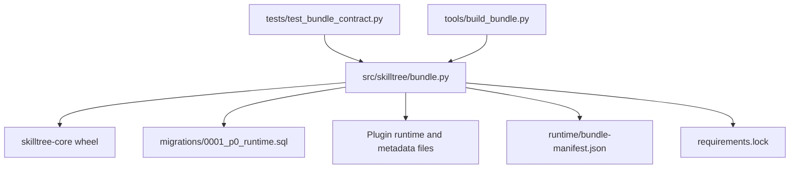

# P0.1 模块分层

状态：`ready_for_user_acceptance`

| 文件或符号 | 职责 |
| --- | --- |
| `src/skilltree/bundle.py::build_bundle` | 在临时目录构建 Core wheel，再发布 P0 artifact。 |
| `src/skilltree/bundle.py::validate_bundle` | 只读校验 Manifest、migration、lock、wheel、Hook bundle 和 aggregate hash。 |
| `tools/build_bundle.py` | 构建入口，只输出 Bundle hash 或失败。 |
| `plugins/skilltree/migrations/0001_p0_runtime.sql` | P0 运行时数据库定义，不预建后续阶段表。 |
| `tests/test_bundle_contract.py` | 发布目录合约、hash、P0 DDL 和篡改拒绝回归测试。 |
