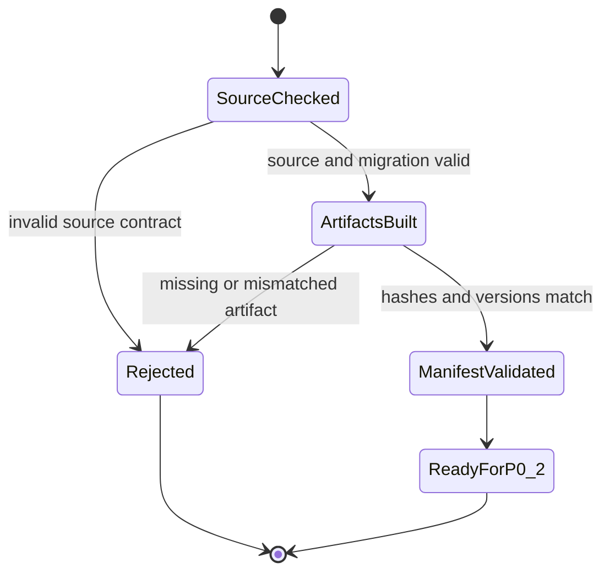

# P0.1 状态流转

状态：`ready_for_user_acceptance`

```mermaid
stateDiagram-v2
  [*] --> SourceChecked
  SourceChecked --> ArtifactsBuilt: source and migration valid
  SourceChecked --> Rejected: invalid source contract
  ArtifactsBuilt --> ManifestValidated: hashes and versions match
  ArtifactsBuilt --> Rejected: missing or mismatched artifact
  ManifestValidated --> ReadyForP0_2
  Rejected --> [*]
  ReadyForP0_2 --> [*]
```

这是 `build_bundle` / `validate_bundle` 的 Bundle 构建状态，不是 Codex Hook 或用户任务状态机。校验器不创建 venv、SQLite 或 `$PLUGIN_DATA` 文件。
